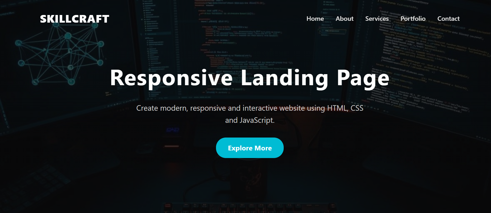
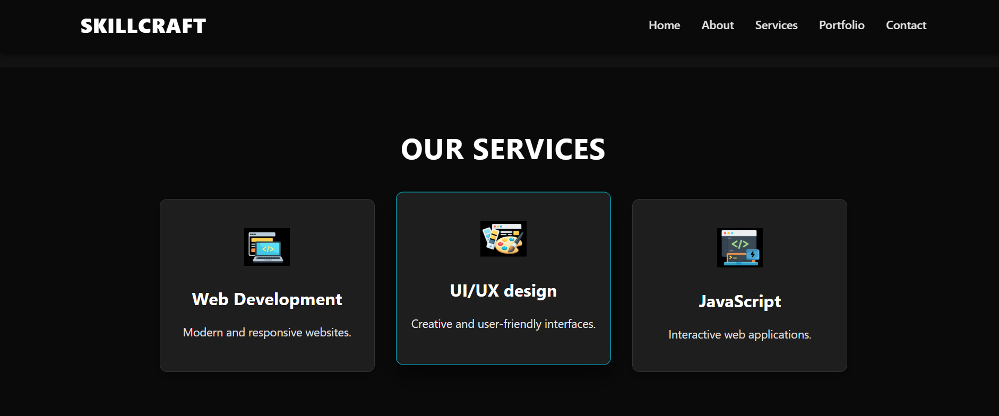
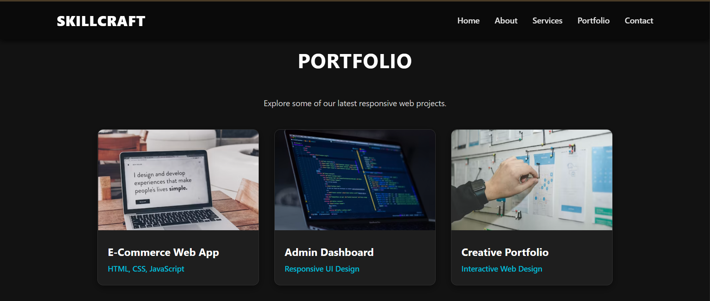
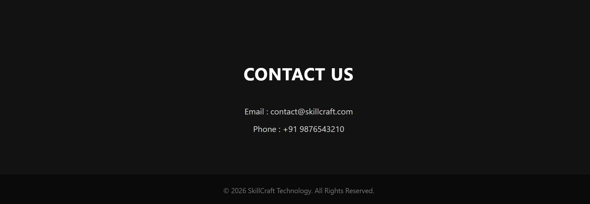

# SCT_WD_1

# SkillCraft Technology - Task 1

## Responsive Landing Page

This project is developed as part of the SkillCraft Technology Web Development Internship.

## Features

- Responsive Navigation Bar
- Hero Section with Background Image
- Smooth Scrolling
- Interactive Hover Effects
- About Section
- Services Section
- Portfolio Section
- Contact Section
- Responsive Design

## Technologies Used

- HTML5
- CSS3
- JavaScript

## Folder Structure

```
SCT_WD_1
│── assets
│   ├── images
│   └── icons
│── index.html
│── style.css
│── script.js
│── README.md
```

## How to Run

1. Clone the repository.
2. Open the project folder.
3. Open `index.html` in your browser.

## Author

**Bhaskar Sharma**
SkillCraft Technology - Web Development Intern

## Project Preview

### Homepage



### Services Section



### Portfolio Section



### Contact Section


